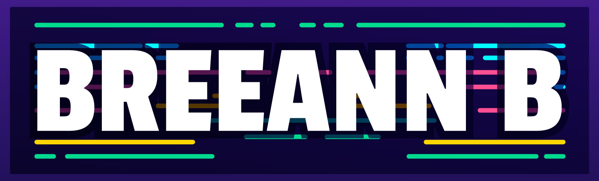

<!-- <!--
**breeannb/breeannb** is a ✨ _special_ ✨ repository because its `README.md` (this file) appears on your GitHub profile. -->

    <h1>
        
        Welcome to my Github Profile!
         
    </h1>

    
Hello there! I’m a Full Stack Software Developer that strives to combine my developer & technical abilities with my graphic design background to create great front-end apps.
  
    
 When I'm not coding, you can find me taking photos in nature, snuggling up to my two kitties, creating art, or on my never-ending quest to find more cheesecake. 

------------

<h3> Tech Stack & Tools:</h3>

------------

<h3> Connect with me:</h3>
    
    
    
    
    
     
<h3> Account Visits:</h3>

 

------------

    <h3>  Stats:</h3>
    

